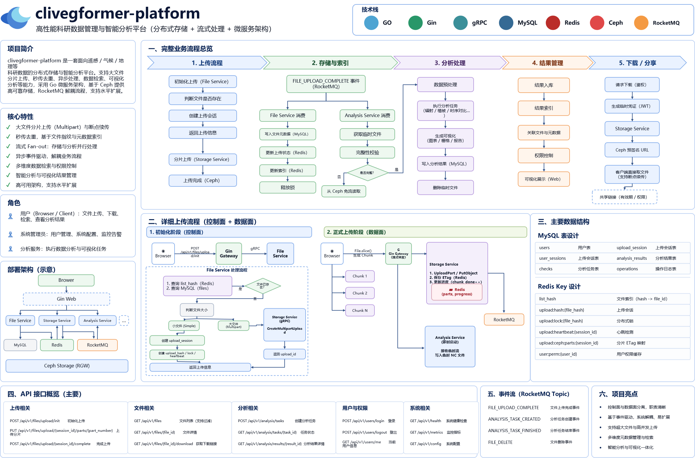
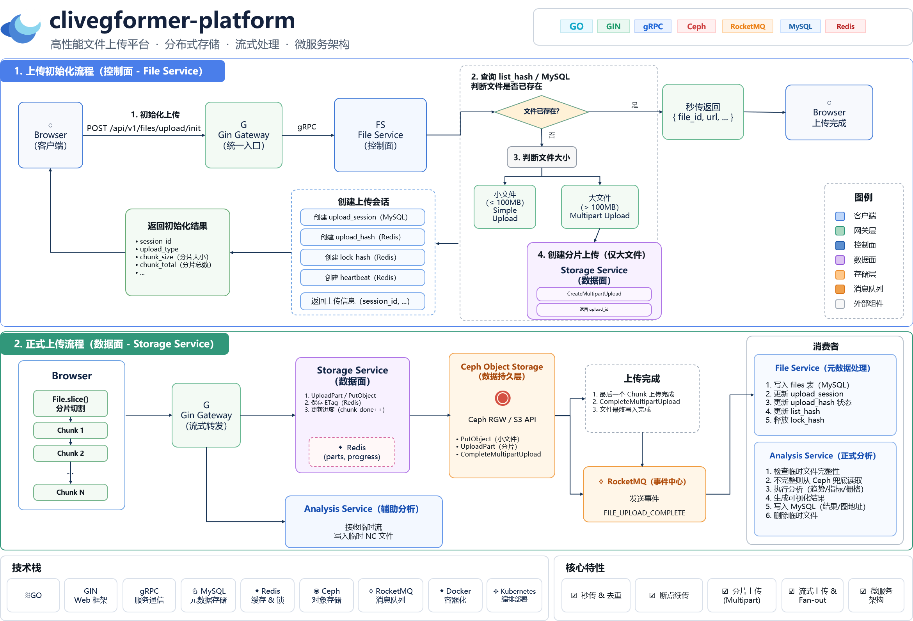

# Clivegformer Platform

<p align="center">
  面向大规模遥感时序数据的分布式存储与智能分析平台
</p>

<p align="center">
  Go · Gin · gRPC · MySQL · Redis · RocketMQ · Ceph · Python · LLM Tool Calling
</p>

---

## 📖 项目简介

**Clivegformer Platform** 是一个面向大规模遥感时序数据的分布式存储与智能分析平台。

项目主要用于解决课题组在 NDVI、气象、土地覆盖等多源遥感时序数据管理过程中存在的以下问题：

- 科研文件数量庞大、分布零散
- NetCDF、HDF 等文件格式复杂
- 单文件体积较大
- 多用户数据共享困难
- 大文件上传稳定性较差
- 文件重复上传导致存储空间浪费
- 科研数据难以按照区域、年份和时间范围快速检索
- 数据分析工具使用门槛较高

平台基于 Go 微服务架构实现文件管理、分布式存储、数据索引和智能分析能力，并结合 Ceph 对象存储、Redis、RocketMQ 以及 Python 分析服务，实现大规模遥感科研数据的统一管理与分析。

---

## ✨ 核心功能

- 大规模遥感科研数据统一管理
- NetCDF / HDF 等科研文件存储
- 大文件分片上传
- S3 Multipart Upload
- 断点续传
- SHA-256 文件指纹
- 文件秒传与重复文件检测
- Redis 分布式锁
- 上传任务状态管理
- 上传任务心跳检测
- RocketMQ 异步消息处理
- 文件元数据索引
- 多维度科研数据检索
- 遥感时序数据分析
- 数据可视化
- LLM Tool Calling 智能分析

---

## 🏗 系统架构

项目采用 Go 微服务架构，将不同业务能力拆分为独立服务。

主要包括：

| 服务 | 功能 |
| --- | --- |
| Gin Gateway | HTTP 统一接入、认证、请求路由、文件流式转发 |
| File Service | 文件管理、文件去重、上传任务管理、元数据索引 |
| Storage Service | Ceph 对象存储、大文件分片上传 |
| Analysis Service | NetCDF / HDF 数据解析、可视化和智能分析 |
| MySQL | 文件元数据与业务数据持久化 |
| Redis | 缓存、上传状态、分布式锁、心跳 |
| RocketMQ | 上传完成事件及异步任务解耦 |
| Ceph RGW | S3 兼容的分布式对象存储 |

系统整体架构：
<p align="center">
  
</p>

---

## 📤 文件上传流程
整个文件上传过程分为两个阶段：

1. 上传初始化
2. 正式文件上传

<p align="center">
  
</p>
---

### 1. 上传初始化

浏览器在真正上传文件之前，首先向 File Service 发起上传初始化请求。

File Service 主要负责：

- 根据文件 SHA-256 判断文件是否已经存在
- 判断文件是否可以秒传
- 判断文件是否需要分片上传
- 创建上传任务
- 创建 Redis 上传状态
- 创建上传心跳
- 创建分布式锁

对于需要分片上传的大文件，File Service 调用 Storage Service。

Storage Service 调用 Ceph RGW 的 S3 Multipart Upload 接口创建分片上传任务，并返回：

```text
upload_id
```

随后 File Service 完成上传任务相关数据结构初始化，并将上传信息返回浏览器。

---

### 2. 正式上传

初始化完成后，浏览器开始正式上传文件。

浏览器通过 `File.slice()` 对大文件进行分片。

文件数据首先发送到 Gin Web。

其中：

- Storage Service 为主链路，负责文件持久化
- Analysis Service 为辅助链路，负责接收和分析科研数据

---

## 📦 文件存储

Storage Service 使用 Ceph RGW 提供的 S3 兼容接口进行文件存储。

普通小文件使用：

```text
PutObject
```

大型文件使用：

```text
CreateMultipartUpload
        │
        ▼
UploadPart
        │
        ▼
UploadPart
        │
        ▼
CompleteMultipartUpload
```

通过 Multipart Upload，可以实现：

- 大文件分片上传
- 上传失败重试
- 断点续传
- 分片级状态管理

---

## ⚡ 文件秒传

用户上传文件之前，客户端首先计算文件 SHA-256。

File Service 根据文件 Hash 查询文件是否已经存在。

```text
Browser
   │
计算 SHA-256
   │
   ▼
File Service
   │
查询文件 Hash
   │
 ┌─┴─┐
 │   │
存在 不存在
 │   │
 ▼   ▼
秒传 正常上传
```

如果文件已经存在，则不需要再次向 Ceph 上传完整文件。

通过该机制可以：

- 减少重复文件上传
- 节省网络带宽
- 减少 Ceph 存储空间占用
- 提升大文件上传效率

---

## 🔒 并发上传控制

当多个用户同时上传相同文件时，平台通过 Redis 分布式锁进行并发控制。

Redis Key：

```text
upload:lock:{file_hash}
```

通过：

```text
SET NX EX
```

实现分布式锁。

同时使用：

```text
upload:heartbeat:{session_id}
```

记录上传任务心跳。

当客户端长时间掉线后，系统可以判断上传任务是否失效，并对长期占用的上传任务进行清理。

---

## 🧠 Redis 数据结构

平台主要使用以下 Redis 数据结构。

### 文件 Hash 索引

```text
all_file
```

用于维护：

```text
file_hash -> file_id / object_key
```

主要用于文件秒传判断。

---

### 上传任务

```text
upload_session
```

记录：

```text
session_id
file_hash
user_id
file_size
status
is_multipart
upload_id
chunk_total
chunk_done
create_at
update_at
```

---

### Ceph 分片信息

```text
upload:ceph:parts:{file_hash}
```

记录：

```text
partNumber -> ETag
```

用于最终调用：

```text
CompleteMultipartUpload
```

---

### 上传锁

```text
upload:lock:{file_hash}
```

用于控制相同文件的并发上传。

---

### 上传心跳

```text
upload:heartbeat:{session_id}
```

用于判断客户端上传任务是否仍然存活。

---

## 📨 RocketMQ

当 Storage Service 确认 Ceph 文件已经完整上传后，发送上传完成事件：

```text
FILE_UPLOAD_COMPLETE
```

消费者包括：

```text
File Service
Analysis Service
```

File Service 消费消息后：

```text
更新文件状态
        │
        ▼
写入 MySQL
        │
        ▼
更新 Redis
```

Analysis Service 消费消息后：

```text
检查临时文件
        │
    ┌───┴───┐
    │       │
  完整      缺失
    │       │
    │    从 Ceph 补充读取
    │       │
    └───┬───┘
        ▼
      数据分析
        │
        ▼
      可视化
        │
        ▼
      结果入库
```

通过消息队列将：

```text
文件存储
文件管理
数据分析
```

进行解耦。

---

## 🔍 文件检索

平台不仅保存文件对象，还会将遥感科研数据的元数据保存到 MySQL。

支持根据以下条件进行检索：

- 文件名称
- 文件 Hash
- 文件 Owner
- 区域
- County
- 年份
- 开始时间
- 结束时间
- 数据类型
- 文件状态

从而实现对大规模科研文件的快速定位。

---

## 🤖 智能分析

Analysis Service 负责对遥感科研数据进行分析。

支持的数据类型包括：

- NetCDF
- HDF
- NDVI
- 气象数据
- Land Cover

可以提供：

- NDVI 时间序列趋势分析
- 栅格统计
- 指定时间范围数据分析
- 不同时间段数据对比
- 数据可视化

系统还可以结合 LLM Tool Calling，根据用户的自然语言请求自动调用对应的数据分析工具。

例如：

```text
用户：

分析 2012 年 Iowa 地区 NDVI 的变化趋势
```

LLM 可以自动调用：

```text
SearchFile
      │
      ▼
LoadNetCDF
      │
      ▼
AnalyzeNDVITrend
      │
      ▼
GenerateVisualization
```

最终返回分析结果。

---

## 🛠 技术栈

| 类别 | 技术 |
| --- | --- |
| 开发语言 | Go |
| Web 框架 | Gin |
| RPC | gRPC |
| ORM | GORM |
| 数据库 | MySQL |
| 缓存 | Redis |
| 消息队列 | RocketMQ |
| 对象存储 | Ceph RGW |
| 对象存储协议 | S3 API |
| 数据分析 | Python |
| AI | LLM Tool Calling |
| 容器化 | Docker |

---

## 📁 项目结构

```text

```

---

## 🚀 快速开始

### 环境要求

运行本项目需要以下环境：

```text
Go
MySQL
Redis
RocketMQ
Ceph RGW
Python
```

### 克隆项目

```bash
git clone https://github.com/littleSlowTrain/clivegformer-platform.git
```

进入项目目录：

```bash
cd clivegformer-platform
```


## 🗺 开发计划

- [ ] 完善 API Gateway
- [ ] 完善 File Service
- [ ] 完善 Storage Service
- [ ] Ceph Multipart Upload
- [ ] Redis 上传任务管理
- [ ] 文件秒传
- [ ] 分布式并发上传控制
- [ ] RocketMQ 上传完成事件
- [ ] Analysis Service
- [ ] 遥感元数据检索
- [ ] NDVI 时序分析
- [ ] LLM Tool Calling
